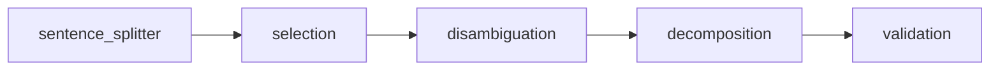

# Claim Extractor 🔎

Hey there! This is a LangGraph implementation of the awesome Claimify methodology that helps extract factual claims from text. I've been working on this for a while, and I think it's pretty cool - it gives you a nice pipeline for identifying, fixing ambiguities, and pulling out verifiable claims from Q&A pairs.

## 📋 What's this all about?

So basically, we're implementing the approach from ["Towards Effective Extraction and Evaluation of Factual Claims"](https://arxiv.org/abs/2502.10855) by Metropolitansky & Larson (2025). Their Claimify method breaks things down into stages that make a ton of sense:

1. **Sentence Splitting**: Chop up text into sentences (with their context)
2. **Selection**: Find which sentences actually have verifiable stuff in them
3. **Disambiguation**: Fix up any confusing references or unclear meanings
4. **Decomposition**: Pull out individual, stand-alone factual claims
5. **Validation**: Double-check that claims are proper sentences

## 🔍 Why this matters

Let's be real - LLMs can sometimes generate content that's... well, not exactly grounded in facts. For lengthy outputs with lots of info, a good way to fact-check is to break it down into simple "claims" that can each be verified separately.

But here's the thing - the whole system falls apart if your extracted claims are garbage! That's why we need a solid method for getting high-quality claims. And that's exactly what this project delivers!

## 🚀 Getting Started

```bash
# Clone the repo
git clone https://github.com/bharathxd/fact-checker.git
cd fact-checker

# Install dependencies 
poetry install
```

Don't forget your environment variables:
```
# Add to .env file (you'll need this!)
OPENAI_API_KEY=your_api_key_here
```

## 📝 How to use it

Here's a quick example that shows how easy it is to use:

```python
from claim_extractor import graph

# Let's process a Q&A to extract claims
result = graph.invoke({
    "question": "What are the key factors driving climate change?",
    "answer_text": "The primary drivers of climate change include greenhouse gas emissions from burning fossil fuels, deforestation, and industrial processes. The IPCC report indicates that human activities have caused approximately 1.0°C of global warming above pre-industrial levels."
})

# Check out the claims we extracted!
for claim in result["validated_claims"]:
    print(f"✓ {claim.claim_text}")
```

## 📊 How the pipeline works

We're using LangGraph to create a workflow that goes like this:



Each step in the pipeline does it's own thing:

- **sentence_splitter_node**: Breaks text into chunks and adds context
- **selection_node**: Figures out which sentences have facts we can check
- **disambiguation_node**: Clears up any confusing references
- **decomposition_node**: Extracts the individual claims
- **validation_node**: Makes sure claims are properly formed

## ⚙️ Tweaking the settings

If you wanna customize things, check out the settings in `claim_extractor/config/`:

- `nodes.py`: Has all the settings for each processing stage
- `llm/config.py`: Change LLM model and temperature settings here

## 🔬 What makes this cool

- **Multi-stage Processing**: Breaking down a complex problem into manageable steps
- **Robust Disambiguation**: Handles both referential and structural ambiguity (which is super tricky!)
- **Voting Mechanism**: Uses multiple completions with voting for better reliability
- **Modular Design**: Easy to extend or tweak individual parts

## 👨‍💻 Project Structure

If you're digging into the code, here's how things are organized:

```
claim_extractor/
├── __init__.py
├── agent.py               # The main LangGraph workflow
├── config/                # Where all the settings live
├── llm/                   # LLM stuff
├── nodes/                 # The pipeline components
│   ├── sentence_splitter.py
│   ├── selection.py
│   ├── disambiguation.py
│   ├── decomposition.py
│   └── validation.py
├── schemas.py             # Data models
└── utils/                 # Helper functions
```

## 📚 The science behind it

This implementation comes from the Claimify methodology, which evaluates claim extraction on three main criteria:

1. **Entailment**: Claims must logically follow from the source text
2. **Coverage**: Need to capture all the verifiable info (but skip the fluff)
3. **Decontextualization**: Claims should make sense on their own

The research by Metropolitansky & Larson shows that this approach outperforms existing methods - especially because it can handle ambiguity and only extracts claims when theres high confidence in the correct interpretation.

## 🙏 Thanks to

- Dasha Metropolitansky & Jonathan Larson from Microsoft Research - for creating Claimify
- LangChain team - for the LangGraph framework that made this possible
- OpenAI - for providing the underlying LLM

## 💬 Citation

This project is an implementation of the Claimify methodology developed by Metropolitansky and Larson. I'm not affiliated with the original research, but if you use this implementation in your work, please cite the original paper:

```bibtex
@misc{metropolitansky2025towards,
  author = {Metropolitansky, Dasha and Larson, Jonathan},
  title = {Towards Effective Extraction and Evaluation of Factual Claims},
  year = {2025},
  month = {February},
  abstract = {A common strategy for fact-checking long-form content generated by Large Language Models (LLMs) is extracting simple claims that can be verified independently. Since inaccurate or incomplete claims compromise fact-checking results, ensuring claim quality is critical. However, the lack of a standardized evaluation framework impedes assessment and comparison of claim extraction methods. To address this gap, we propose a framework for evaluating claim extraction in the context of fact-checking along with automated, scalable, and replicable methods for applying this framework, including novel approaches for measuring coverage and decontextualization. We also introduce Claimify, an LLM-based claim extraction method, and demonstrate that it outperforms existing methods under our evaluation framework. A key feature of Claimify is its ability to handle ambiguity and extract claims only when there is high confidence in the correct interpretation of the source text.},
  url = {https://www.microsoft.com/en-us/research/publication/towards-effective-extraction-and-evaluation-of-factual-claims/},
}
```

Check out the full paper at: https://www.microsoft.com/en-us/research/publication/towards-effective-extraction-and-evaluation-of-factual-claims/
